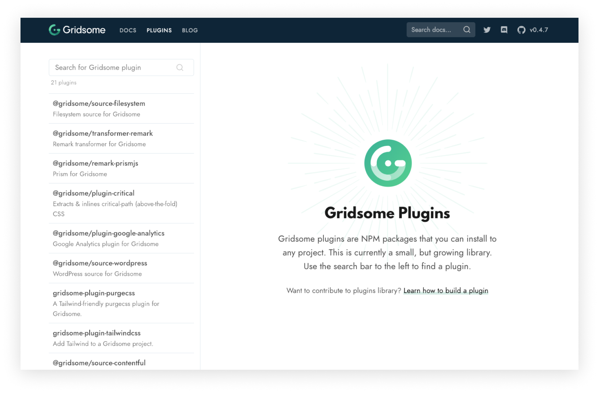

## Filtering GraphQL data

Each content type collection in the GraphQL schema has a new `filter` argument which can be used to filter the results. You can filter by `id`, `title`, `slug`, `path` or any custom field.

Read more about [Filtering data](/docs/filtering-data)

## Create taxonomy pages

All references in the GraphQL schema has been a one-way relation. This release introduces a new field called `belongsTo` for all content types. The field will list all nodes that have a reference back to the current node which makes it very useful to create taxonomy pages etc. The field can also take the same arguments as a collection. And the `@paginate` directive can be used to automatically paginate the results.

For example, this can be used to:
- List blog posts for an author.
- List posts for a tag or category.

We're using this feature on **Gridsome blog** for the **authors**. The authors here are just a YAML file that lists authors, and then Gridsome magically connects it all.

Read more about [Taxonomies](/docs/taxonomies)

## Variables in Page Query

Previously, only `$path` and `$page` were available as variables for `page-query` in templates. But you can now use `$id`, `$title`, `$slug`, `$date` or any custom field from the current `node`. Deep objects and arrays can also be used as variables.

- `$id` resolves to `node.id`
- `$value` resolves to `node.fields.value`
- `$object__value` resolves to `node.fields.object.value`
- `$array__3__id` resolves to `node.fields.array[3].id`

Read more about [Query data in templates](/docs/querying-data#query-data-in-templates)

## Environment variables

Sometimes you want configuration values that are different from what you have in the production build. Gridsome now utilizes the [dotenv](https://www.npmjs.com/package/dotenv) package to make this easy. Special thanks to [isoppp](https://github.com/isoppp) for implementing this feature 😄

Read more about [Environment Variables](/docs/environment-variables)

## New Plugin library

The [Plugins](/plugins) page now gets plugins from NPM directory. Any plugin with keyword `gridsome-plugin` will be listed here. You can also use the search field for filtering.

## Other features and fixes

- Updated to [Vue 2.6](https://medium.com/the-vue-point/vue-2-6-released-66aa6c8e785e).
- Create references in any node field. [Read more](/docs/data-store-api#storecreatereferencetypename-id).
- Hook for configuring the development server. [Read more](/docs/server-api#apiconfigureserverfn).
- Customize default `index.html` template (by [K3TH3R](https://github.com/K3TH3R)).
- Add custom CSS loader options (by [maoberlehner](https://github.com/maoberlehner)).

## Breaking changes 😅

There are no breaking API changes, but some changes might have consequences:

- External image URLs has previously been converted to objects. Which required you to get the actual URL in a `imageField.src` property. But those fields are no longer converted to objects.
- Filepaths in front matter or markdown must start with `./` or `../` to be resolved and processed. Which means `image.png` will not be processed, but `./image.png` will be.

## What's next

- Download and process external images.
- Page transitions.
- Smoother image loading for `<g-image>` (Fade in).
- GraphQL schema stitching.
- Full PWA support.
- Performance optimizations.
- Move the [gridsome.org](https://gridsome.org) repository into core repository for easier contribution.
- Create a starter gallery where anyone can submit a starter.
- Docs docs docs!

Thanks for all contributions to documentation, features, bugfixes and plugins so far!

[mouafa](https://github.com/mouafa), [ekoeryanto](https://github.com/ekoeryanto), [stefanoverna](https://github.com/stefanoverna), [jankal](https://github.com/jankal), [valentinvieriu](https://github.com/valentinvieriu), [andrewhl](https://github.com/andrewhl), [0aveRyan](https://github.com/0aveRyan), [hagata](https://github.com/hagata), [ameistad](https://github.com/ameistad), [physcocode](https://github.com/physcocode), [Devportobello](https://github.com/Devportobello), [boedlen](https://github.com/boedlen), [tyankatsu0105](https://github.com/tyankatsu0105), [thien-hoang](https://github.com/thien-hoang), [EldoranDev](https://github.com/EldoranDev), [matt-e-king](https://github.com/matt-e-king), [mottox2](https://github.com/mottox2), [crsten](https://github.com/crsten), [erquhart](https://github.com/erquhart), [alexjoverm](https://github.com/alexjoverm), [simonswiss](https://github.com/simonswiss), [JimmyAppelt](https://github.com/JimmyAppelt), [HTMLbyJoe](https://github.com/HTMLbyJoe), [seahken](https://github.com/seahken), [stursby](https://github.com/stursby), [kimihito](https://github.com/kimihito), [davidleininger](https://github.com/davidleininger), [newbornfrontender](https://github.com/newbornfrontender), [gangsthub](https://github.com/gangsthub), [maikelvl](https://github.com/maikelvl), [NTpspE](https://github.com/NTpspE), [robaxelsen](https://github.com/robaxelsen), [Truemedia](https://github.com/Truemedia), [wonder95](https://github.com/wonder95), [Stegosource](https://github.com/Stegosource), [ovsw](https://github.com/ovsw), [erwin16](https://github.com/erwin16), [itsnwa](https://github.com/itsnwa), [luklus](https://github.com/luklus), [FistMeNaruto](https://github.com/FistMeNaruto), [eostrom](https://github.com/eostrom), [tonyspiro](https://github.com/tonyspiro), [Qoyyuum](https://github.com/Qoyyuum), [tanc](https://github.com/tanc), [dapd007](https://github.com/dapd007), [samuelgoddard](https://github.com/samuelgoddard), [Splode](https://github.com/Splode), [SteveEdson](https://github.com/SteveEdson), [YogliB](https://github.com/YogliB), [mittalyashu](https://github.com/mittalyashu) and [sanscheese](https://github.com/sanscheese) 💪

Read the [change log](https://github.com/gridsome/gridsome/blob/master/gridsome/CHANGELOG.md) for all new features and bugfixes.
