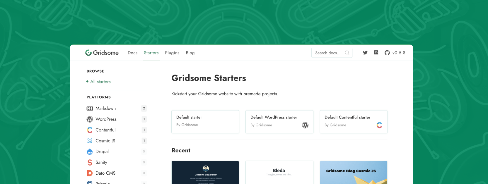

💥 *This version includes breaking changes.*

## The new Pages API

Until now, you have only been able to create pages by having Vue components in the `src/pages` folder or by creating templates for content types. Gridsome 0.6 comes with a new API for creating pages. It lets you create pages programmatically, which will give you much more flexibility.

**Very basic example:**

```js
// gridsome.server.js
module.exports = function (api) {
  api.createPages(({ createPage }) => {
    createPage({
      path: '/my-page',
      component: './src/templates/MyPage.vue'
    })
  })
}
```

You can use it to create pages manually from the GraphQL data layer:

```js
module.exports = function (api) {
  api.createPages(async ({ graphql, createPage }) => {
    const { data } = await graphql(`
      {
        allProduct {
          edges {
            node {
              id
              path
            }
          }
        }
      }
    `)

    data.allProduct.edges.forEach(({ node }) => {
      createPage({
        path: `${node.path}/reviews`,
        component: './src/templates/ProductReviews.vue',
        context: {
          id: node.id
        }
      })
    })
  })
}
```

... or you could **bypass GraphQL** if you think it's a overkill in some use cases:

```js
//gridsome.server.js
module.exports = function (api) {
  api.createManagedPages(async ({ createPage }) => {
    const { data } = await axios.get('https://api.example.com/posts')

    data.forEach(item => {
      createPage({
        path: `/posts/${item.path}`,
        component: './src/templates/Post.vue',
        context: {
          title: item.title,
          content: item.content
        }
      })
    })
  })
}
```

Add data by using `$context` in Vue component.

```html
<template>
  <Layout>
    <h1>{{ $context.title }}</h1>
    <div v-html="$context.content"></div>
  </Layout>
</template>
```

Read more about the [Pages API](/docs/pages-api/)

## New function for fetching internal pages
A new function available in [Client API](/docs/client-api/) lets you fetch internal pages. This is perfect for building lightboxes or «Click for more» pagination etc.

```js
export default {
  data () {
    return {
      fetchedPage: null
    }
  },
  async mounted () {
    try {
      const results = await this.$fetch('/a-page-path')
      this.fetchedPage = results.data
    } catch (error) {
      console.log(error)
    }
  }
}
```

Learn more about [fetching internal pages](/docs/client-side-data/)


## Faster build times and smaller core JS bundle size

Gridsome has been importing `page-query` data with webpack dynamic imports which means that webpack had to compile every JSON file into a JavaScript chunk. Having lots of pages would increase build times unnecessary. From now on, page data will be stored as raw JSON files without interference from webpack. And each file is prefetched and loaded on demand for each page. The overall JavaScript size is reduced by about 30% in most cases.

**Example when building a site with 8300 pages:**

|  | Before | After |
|-|-------:|-----:|
| Run webpack | 50s | **10s** |
| Execute GraphQL | 25s | 25s |
| Render HTML | 15s | 15s |
| `app.js` size | 475kb | **170kb** |
| `page-query.js` size | 510kb | *removed* |
| Size of all JS chunks | 1000kb (excl. data chunks) | **570kb** (total) |


## New website design and starters library
We redesigned https://gridsome.org to be more lightweight & clean. This is a website you will spend a lot of time at if you're developing Gridsome projects. We wanted it to require as little CPU power as possible. The old website killed CPUs with SVG path animations.

We also added a [Starter library](/starters) to help anyone get quickly up and running with Gridsome.



## Breaking changes

- `NodeInterface` is renamed to `Node`.
- `title`, `path`, `date`, `content`, `excerpt`, and `slug` are now custom fields.
- Custom fields are no longer camel cased automatically.
  - Some plugins depends on the original field names to work properly.
- Routes for pages in `src/pages` no longer get automatic names
  - This was changed because automatic route names would most likely conflict with custom pages.
  - Links like `<g-link :to="{name: 'about'}">` needs to be updated to `<g-link to="/about">`. Or add a custom `name` to the Page.

## Other features and fixes

- Add custom node fields as top-level options. [Read more](/docs/data-store-api#collectionaddnodeoptions)
- Limit argument for GraphQL. [Read more](/docs/querying-data#limit)
- Advanced GraphQL sort argument. [Read more](/docs/querying-data#advancedsorting)
- Configure webpack without chaining. [Read more](/docs/config#configurewebpack)
- Render the current state in markup to prevent initial request.

You will find all the changes in the [changelog](https://github.com/gridsome/gridsome/blob/master/gridsome/CHANGELOG.md)


## 3000 GitHub Stars 🌟🎉

Thanks to everyone who have contributed! Gridsome is going fast on its mission to be the best and easiest way to build modern websites and PWAs for any data source.
