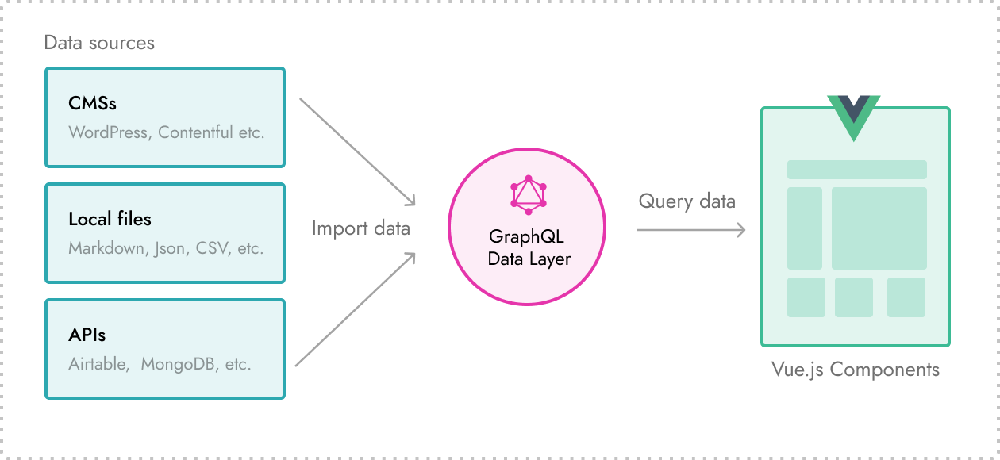

# The GraphQL data layer

**The GraphQL data layer is a tool available in development mode**. This is where all the data imported into a Gridsome project is temporary stored. Think of it as a local database that helps you work faster and better with your data.

Data coming from the GraphQL data layer is generated into **static content**. There is no real-time connection between the data layer and the source the data is imported from. This means you need to re-generate the website to get the latest data updates.

If you need dynamic data you should use [client-side data](/docs/client-side-data/).

💡 **Pages and Site metadata are added to the data layer by default.**

### Working with data
 - [How to import data](/docs/fetching-data/).
 - [How to query data](/docs/querying-data/).
 - [How to filter data](/docs/filtering-data/).
 - [How to create taxonomy pages](/docs/taxonomies/).
 - [How to paginate data](/docs/pagination/).
 - [How to add client-side / dynamic data](/docs/client-side-data/).

### The GraphQL explorer

Every Gridsome project has a **GraphQL explorer (Playground)** that can be used to explore and test queries when in development mode. Here you also get a list of all available GraphQL collections. This can usually be opened by going to `http://localhost:8080/___explore`.

