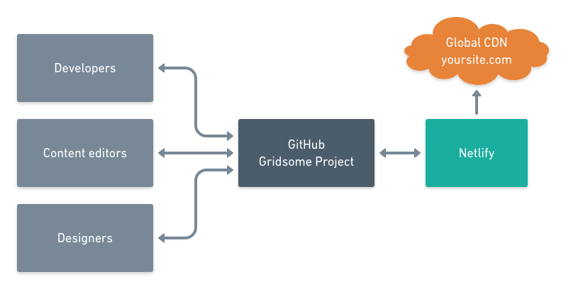

# Hosting & Deployment

Gridsome sites are static generated at build time. This means that the site can be hosted anywhere, and does not require any database. It can be hosted on a global CDN or even uploaded manually via FTP. Your site will also be virtually un-hackable since there is no database connected. With Gridsome you don't need any caching or security plugins like you do in a traditional CMS like WordPress.

### Git-based deploying

The best practice when working with Gridsome sites is to have your project hosted on a Git-service like GitHub and connect a deploy service that auto builds your site from a selected repository. [Netlify](//www.netlify.com/) is the best solution for this now. They also have free plan for static website hosting.

This gets your whole team in sync, and is the perfect modern workflow for building websites. These services are great for Git-based deploying:

- [Netlify](/docs/deploy-to-netlify)

- [Zeit Now](/docs/deploy-to-netlify)

### Deploy from terminal
Many services let you deploy your static Gridsome site from the terminal. Here are some:

- [Amazon S3](/docs/deploy-to-amazon-s3)

- [Zeit Now](/docs/deploy-to-zeit-now)

### FTP deploying

To host your site on traditional hosting via FTP you need to manually build your project from the Terminal.

- Run `gridsome build` in your project folder.
- This will generate a `dist` folder where your generated site is located.
- Upload the content of this folder to any FTP to get started.
