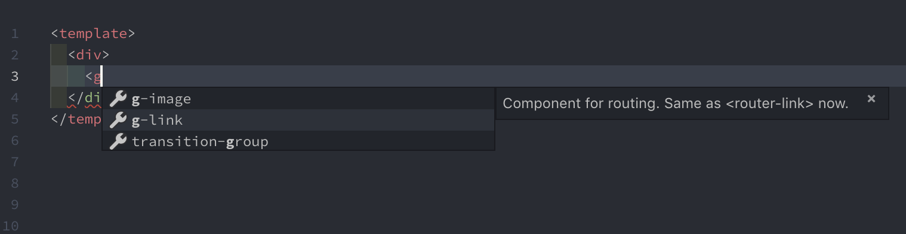
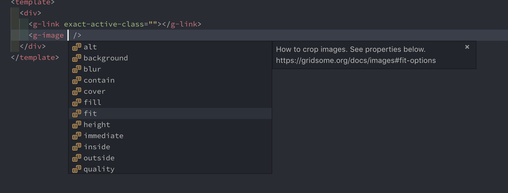
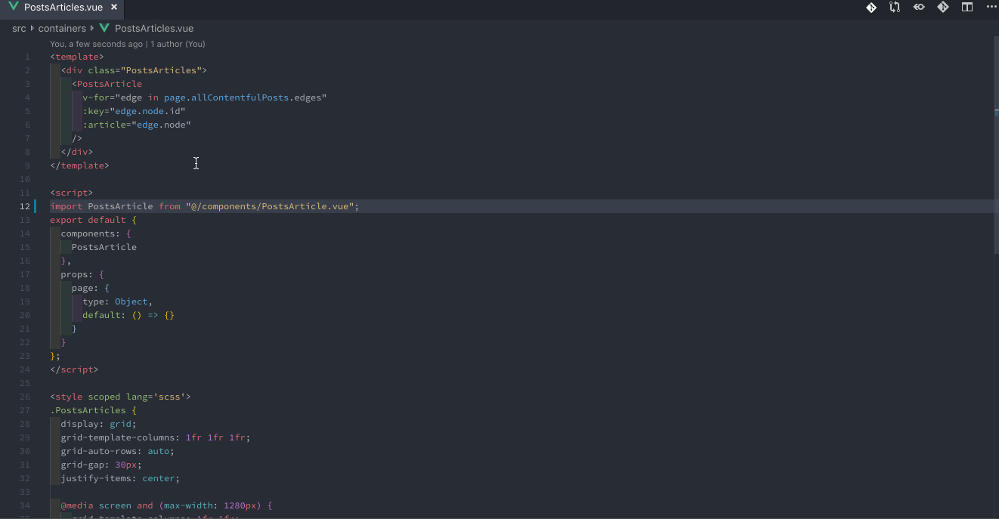

# Dev tools

Tools for easier Gridsome development


## ESLint plugin
https://www.npmjs.com/package/eslint-plugin-gridsome

## Vetur

[Vetur](https://marketplace.visualstudio.com/items?itemName=octref.vetur) is Vue tooling for VS Code.  
Vetur works perfect with Gridsome.

### GraphQL syntax for `<page-query>` and `<static-query>`

Detail is [here](https://github.com/vuejs/vetur/issues/975#issuecomment-461197031)  

1. Install [GraphQL](https://marketplace.visualstudio.com/items?itemName=kumar-harsh.graphql-for-vscode)
2. Add this item in `settings.json`
```json
{
  ... ,
  "vetur.grammar.customBlocks": {
    "page-query": "graphql",
    "static-query": "graphql"
  },
  ...
}
```

3. Run command `Vetur: Generate Grammar`

### Autocompletion

Vetur has [gridsome-helper-json](https://www.npmjs.com/package/gridsome-helper-json) since version 0.17.0
helper-json can autocomplete tag and attribute.
gridsome-helper-json support `<g-image>`, `<g-link>` and `<Pager>`.





### Path mapping

Gridsome can use Webpack's alias.  
Vetur provide [path mapping](https://github.com/vuejs/vetur/blob/master/docs/setup.md#path-mapping).

1. At project root create a `jsconfig.json`.

```json
{
  "include": ["./src/**/*"],
  "compilerOptions": {
    "baseUrl": ".",
    "paths": {
      "@/*": ["src/*"]
    }
  }
}
```

2. Add suffix `.vue` where import syntax.

```js
import VueFile from "@/path/to/VueFile.vue";
```


