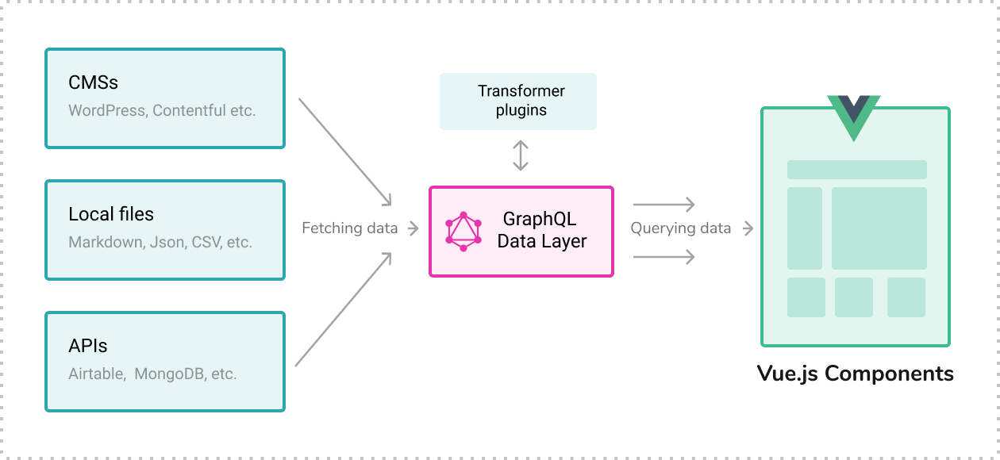

# Fetching data
Fetch content from local files or external APIs and store the data in a local database. A unified GraphQL Data layer lets you extract only the data you need from the database and use it in your Vue.js components.




## Use data source plugins
Gridsome data source plugins are added in `gridsome.config.js`. You can find available data source plugins in the [Plugins directory](/plugins).


Here is an example of the [file-system](/plugins/@gridsome/source-filesystem) source added to config:
```js
module.exports = {
  plugins: [
    {
      use: '@gridsome/source-filesystem',
      options: {
        index: ['README'],
        path: 'docs/**/*.md',
        typeName: 'DocPage',
      }
    },
    {
      // another data source
    },
  ]
}
```

`typeName` will be the name of the GraphQL collection and needs to be unique. This example will add a **DocPage** collection.

Every data source has different options, so take a look at their documentation to learn more.


## Add data from APIs

Gridsome adds data to the GraphQL data layer with the **Data store API** and the `api.loadSource` function. To use the API you need a `gridsome.server.js` file in the root folder of your Gridsome project.


Learn more about the [Data store API here](/docs/data-store-api)

A typical `gridsome.server.js` will look something like this:

```js
const axios = require('axios')

module.exports = function (api) {
  api.loadSource(async store => {
    const { data } = await axios.get('https://api.example.com/posts')

    const contentType = store.addContentType({
      typeName: 'BlogPosts'
    })

    for (const item of data) {
      contentType.addNode({
        id: item.id,
        title: item.title
      })
    }
  })
}
```

> Data is fetched when starting a development server or start of a production build. You need to restart the server for the changes in **gridsome.server.js** to take effect.


## Add data from local files
..

### Markdown
..

### Images
..

### YAML
..

### CSV
..

### JSON
