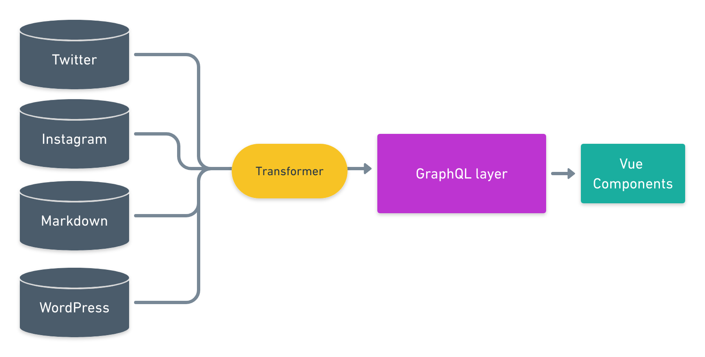

# The GraphQL layer

Gridsome lets you connect to any data source by using **Source plugins**. This is the core functionality of Gridsome. All data coming from sources are pulled into a GraphQL layer that the Vue components can access.

**The GraphQL layer is only used in development and not used in production for static sites. It only uses the GraphQL data for generating HTML files blazing fast**



**Transformer plugins** is used to transform the content (Nodes) coming from the data sources. For example, for Filesystem source we have a Remark plugin that adds extra functionality to Markdown files.


## The GraphQL playground
Every Gridsome project has a GraphQL playground they can use to explore and test queries when in development mode. This can usually be opened by going to `http://localhost:8080/___explore`.


## Add GraphQL to Pages

Every **Page** can have a `<page-query>` block with a GraphQL query
to fetch data from data sources. The results will be stored in a
`$page` property inside the page component.

```html
<template>
  <Layout>
    <h2>Latest blog posts</h2>
    <ul>
      <li v-for="edge in $page.allWordPressPost.edges" :key="edge.node._id">
        {{ edge.node.title }}
      </li>
    </ul>
  </Layout>
</template>

<page-query>
query Blog {
  allWordPressPost (limit: 5) {
    edges {
      node {
        id
        title
      }
    }
  }
}
</page-query>
```


## Add pagination to GraphQL queries
Gridsome has built-in component and functionality to paginate GraphQL queries.


```html
<template>
  <Layout>
    <ul>
      <li v-for="{ node } in $page.allWordPressPost.edges" :key="node._id">
        <h2>{{ node.title }}</h2>
        <g-link :to="node.path">Read more</g-link>
      </li>
    </ul>
    <Pager :info="$page.allWordPressPost.pageInfo"/>
  </Layout>
</template>

<script>
import { Pager } from 'gridsome'

export default {
  components: {
    Pager
  }
}
</script>

<page-query>
query Blog ($page: Int) {
  allWordPressPost (perPage: 10, page: $page) @paginate {
    pageInfo {
      totalPages
      currentPage
    }
    edges {
      node {
        id
        title
        path
      }
    }
  }
}
</page-query>
```
Learn more about pagination [here](/docs/pagination)


## Add GraphQL to Components

Every **Component** can have a `<static-query>` block with a GraphQL query
to fetch data from data sources. The results will be stored in a
`$static` property inside the component.

```html
<template>
  <div v-html="$static.example" />
</template>

<static-query>
query Example {
  example: examplePage (path: "/docs/example") {
    content
  }
}
</static-query>

```


## Add GraphQL to templates

Templates are used for page layout for the "single" endpoint of a data source like for example a WordPress blog post. If you have a node type called `WordPressPost`, then you can create a file
in `src/templates/WordPressPost.vue`.

```html

<template>
  <Layout :title="$page.post.title">
    <div v-html="$page.post.content">
  </Layout>
</template>

<page-query>
query Post ($path: String!) {
  wordPressPost (path: $path) {
    title
    content
  }
}
</page-query>

<script>
export default {
  metaInfo () {
    return {
      title: this.$page.post.title
    }
  }
}
</script>
```
