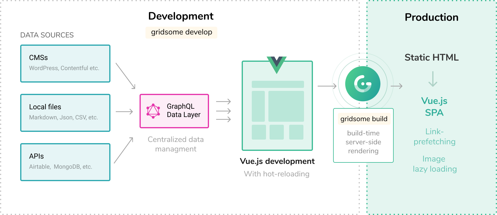
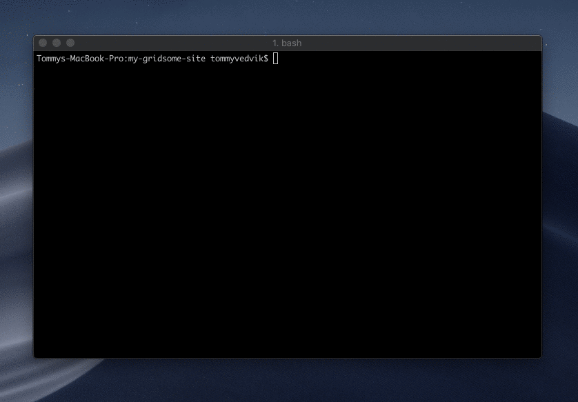
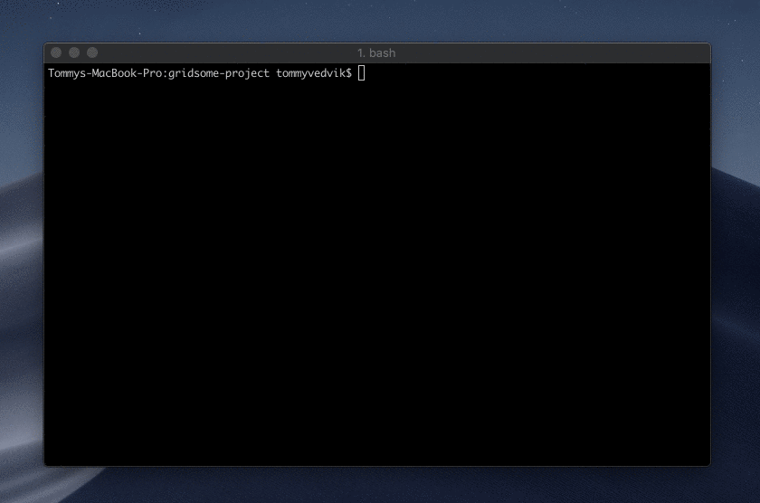

# How it works

Gridsome is a modern website development framework for creating fast and secure websites that can be deployed anywhere. Static HTML files are generated to create SEO-friendly markup that hydrates into a <strong>Vue.js-powered SPA</strong> once loaded in the browser.

Source plugins fetch content from local files or external APIs and store the data in a local database. A unified GraphQL data layer lets you extract only the data you need from the database and use it in your Vue.js components. The data is generated and stored as static JSON at build time.

There are two ways to run Gridsome:

- `gridsome develop` - Starts a **local development server**.
- `gridsome build` - Generates **production ready** static files.

## Gridsome develop

The `gridsome develop` command starts a **local development server** with hot-reloading for code/file changes and the **GraphQL data layer**. You can usually open the development server at `localhost:8080`, and explore the GraphQL data layer at `localhost:8080/___explore`.

**This is what's happening under the hood when running `gridsome develop` command:**

1. **Initialize** - Reads project configuration and initializes installed plugins, etc.
2. **Load sources** - Source plugins fetch their data and update the internal store.
3. **Create GraphQL schema** - Generates the GraphQL schema from node types in the store.
4. **Generate code** - Generates runtime code like routes, plugins, etc.
5. **Bootstrap finish** - Starts the development server and shows the URLs in your console.

### GraphQL for data managment
**The GraphQL data layer is a tool available in development mode**. This is where all the data fetched into a Gridsome project is stored. Think of it as a local, temporary database that helps you work faster and better with your data. Add data from any **data sources** with [Source plugins](/plugins) or with the [Data store API](/docs/data-store-api). Data can be queried in any page or component.

[Learn more about Querying data here](/docs/querying-data).

## Gridsome build

The `gridsome build` command prepares a project for **production**. This means it generates HTML files that are optimized and ready to be hosted and deployed to any FTP or static web host.

**This is what's happening under the hood when running `gridsome build` command:**

1. **Initialize** - Reads project configuration and initializes installed plugins, etc.
2. **Load sources** - Source plugins fetch their data and update the internal store.
3. **Create GraphQL schema** - Generates the GraphQL schema from node types in store.
4. **Generate code** - Generates runtime code like routes, plugins, etc.
5. **Bootstrap finish** - Creates a render queue with all pages and templates.
6. **Run GraphQL** - Executes all `page-query` queries and stores the results in `json` files.
7. **Compile assets** - Runs webpack to compile production-ready assets.
8. **Render HTML** - Renders all pages and templates into static `html` files.
9. **Process files** - Local files are copied to the `dist` folder.
10. **Process images** - Local images are processed and copied to the `dist` folder.

> Services like **Netlify** and **Zeit Now** let you run `gridsome build` automatically from a **Git-repository** and host the generated files on a CDN for you. These services also have hooks that enable you to re-build the site after a Git-commit. Learn more about Git-based [deployment here](/docs/deployment).

### Build time server-side rendering
Gridsome runs server-side rendering at build time. This means you don't need any server like Node.js to run Gridsome sites. They are pre-rendered & static and can be deployed to any static web host or FTP.

## Vue.js for frontend

Gridsome uses [Vue.js](https://vuejs.org/) as front-end framework. Vue is an approachable, simple & fun framework for building fast interfaces. Vue is famous for its intuitive design and shallow learning curve. This means it's easy to train staff in, even non-frontend devs and designers. Since developers will be up-and-running with Vue quickly, training costs will be kept to a minimum.

### Client-side Hydration
The `gridsome build` command generates **SEO-friendly HTML files** that can be hosted anywhere. These HTML files are optimized to load as fast as possible. After the HTML is loaded Vue.js takes over the HTML and **hydrates** into a fully Vue-powered SPA.

>  Hydration refers to the client-side process during which Vue takes over the static HTML sent by the server and turns it into a dynamic DOM that can react to client-side data changes.

[Learn more about Vue.js and Client Side hydration](https://ssr.vuejs.org/guide/hydration.html)

### Automatic link prefetching
Gridsome prefetches internal links in the background so browsing around goes insanely fast. It uses the built-in `<g-link>` component and **Intersection Observer** to prefetch when the link is in view. 

Gridsome builds two files of every page. A static HTML and a small JavaScript file. When the website hydrates into a Vue.js-SPA, the link prefetching only loads the JavaScript to render the next page. This results in a faster and smoother browsing experience.

[Learn more about **g-link** here](/docs/linking).

### Progressive Image support
Gridsome has a built-in `<g-image>` component with built-in progressive image support. In **development** it lets you do real-time image processing, like resizing and cropping.

In production, the `<g-image>` is served as an ultra-compressed image before the image is lazy-loaded when in view by using **Intersection Observer**.

[Learn more about **g-image** here](/docs/images)

## Alternatives

-    **[VuePress.](https://vuepress.vuejs.org/)** Another static site generator for Vue.js. It uses local markdown files for content and is perfect for documentation sites. It is possible to build anything in VuePress and Markdown (Like a blog f.ex).

-    **[Nuxt.](https://nuxtjs.org/)** A Universal Vue.js Framework for server-side rendered (SSR) apps and websites. It also has a static site generator feature, but the main focus is SSR.

-	**[Gatsby.js](https://www.gatsbyjs.org/)**  Gridsome is highly inspired by Gatsby.js (React.js based), which collects data sources and generates a static site from it. Gridsome is an alternative for Gatsby.js.
