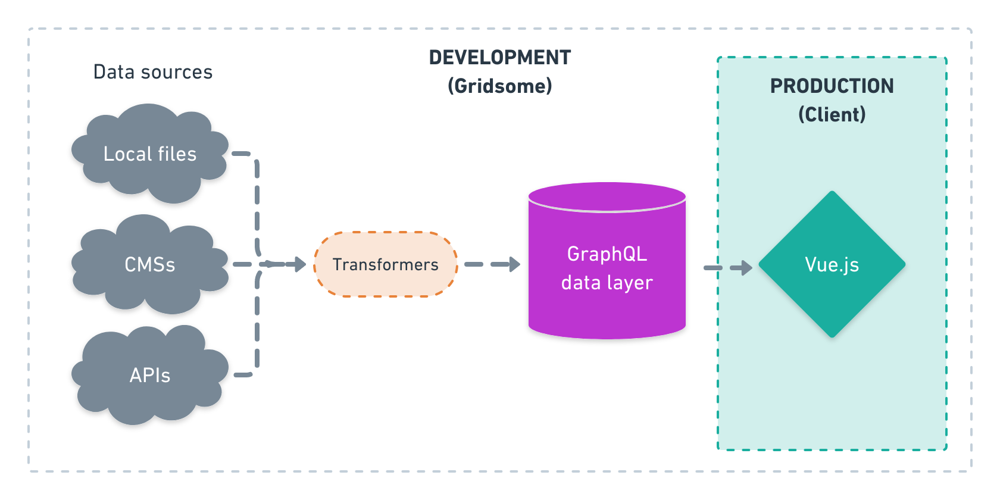

# How it works

asdf

## Data sources
Connect to any data source with **source plugins** or **data store API** and get access to data in a local unified GraphQL data layer.

## Transformers
Transformers are **plugins** that transform nodes / content coming from data source plugins.	

## GraphQL data layer
Gridsome pulls in content from **data sources** into a unified **GraphQL data layer**. Content are pulled in to the data layer when you start development project and at build time. **The GraphQL layer is only used in development and the build step.** There is no connection between the GraphQL data layer and a site in production. To update site in production with latest content you need to re-build your site. This is how static site generators works. This can be done automatically with services like [Netlify](https://netlify.com).

- Learn more about [The GraphQL data layer](/docs/graphql).

## Static site generation (Pre-rendering)

**Gridsome builds two versions of every page**. One HTML page that search engines can crawl for SEO-purpose, and one JavaScript file that Gridsome uses for SPA after first page load. Next pages are lazy-loaded in the background with the `g-link` component. That makes clicking around extremely fast, and your site is 100%-SEO friendly. It even works offline and can be entirely hosted on a CDN.

- Learn more about [Deploying](/docs/deployment).

## PRPL-pattern

Gridsome follows the [PRPL-pattern by Google.](https://developers.google.com/web/fundamentals/performance/prpl-pattern/) and optimizes your site automatically. You don't need to be a performance expert to make fast websites with Gridsome. Your site gets almost perfect scores on Google lighthouse out-of-the-box. These are some of the performance steps that Gridsome takes care of:

- Image compressing & lazy-loading ⚡️ 
- CSS & JS minification ⚡️ 
- Code-splitting ⚡️ 
- HTML compressing ⚡️ 
- Critical CSS (Plugin) ⚡️ 
- Full PWA & Offline-support (plugin) ⚡️

## Alternatives

-	**[VuePress.](https://vuepress.vuejs.org/)** Another static site generator for Vue.js. It uses local markdown files for content and is perfect for documentation sites. It is possible to build anything in VuePress and Markdown (Like a blog f.ex).

-	**[Nuxt.](https://nuxtjs.org/)** A Universal Vue.js Framework for server side rendered (SSR) apps and websites. It also has a static site generator feature, but the main focus is SSR.

-	**[Gatsby.js](https://www.gatsbyjs.org/)**  Gridsome is highly inspired by Gatsby.js (React.js based), which collects data sources and generates a static site from it. Gridsome is an alternative for Vue.js.
