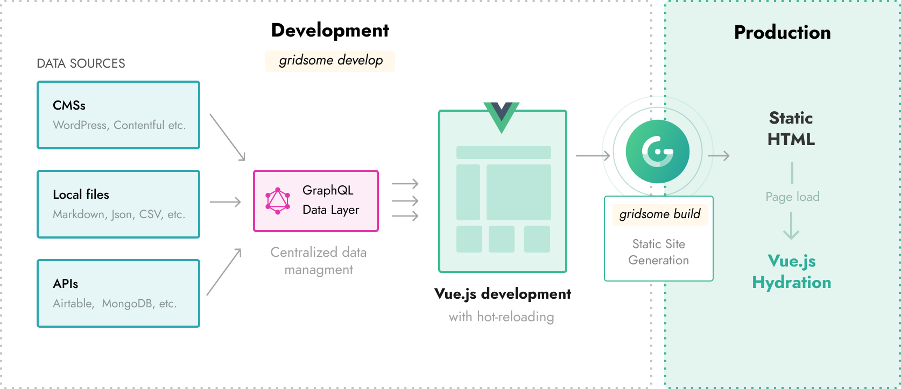

# How it works

There are two ways of running Gridsome.

- Use `gridsome develop` for starting a local **development server**.
- Use `gridsome build` to generate a **production ready** build.

## Gridsome development
The `gridsome develop` command starts a **local development server** with hot-reloading for code / file changes and the **GraphQL data layer**. You can usually open the development server at `localhost:8080`, and explore the GraphQL data layer at `localhost:8080/___explore`.

> The GraphQL data layer is only used when running development server.

**This is whats happening under the hood when running `gridsome develop` command:**

1. **Initialize** - Lorem ipsum dolor sit amet, consectetur adipiscing elit. Cras nec velit sed urna malesuada dignissim varius ut libero.
2. **Load sources** - Lorem ipsum dolor sit amet, consectetur adipiscing elit. Cras nec velit sed urna malesuada dignissim varius ut libero.
3. **Create GraphQL schema** - Lorem ipsum dolor sit amet, consectetur adipiscing elit. Cras nec velit sed urna malesuada dignissim varius ut libero.
4. **Generate code** - Lorem ipsum dolor sit amet, consectetur adipiscing elit. Cras nec velit sed urna malesuada dignissim varius ut libero.
5. **Bootstrap finish** - Lorem ipsum dolor sit amet, consectetur adipiscing elit. Cras nec velit sed urna malesuada dignissim varius ut libero.

## Gridsome build
The `gridsome build` prepares a project for **production**. This means it generates HTML files that are optimized and ready to be hosted and deployed on any FTP or static web host.

**This is whats happening under the hood when running `gridome build` command:**

1. **Initialize** - Lorem ipsum dolor sit amet, consectetur adipiscing elit. Cras nec velit sed urna malesuada dignissim varius ut libero.
2. **Load sources** - Lorem ipsum dolor sit amet, consectetur adipiscing elit. Cras nec velit sed urna malesuada dignissim varius ut libero.
3. **Create GraphQL** - Lorem ipsum dolor sit amet, consectetur adipiscing elit. Cras nec velit sed urna malesuada dignissim varius ut libero.
4. **Generate code** - Lorem ipsum dolor sit amet, consectetur adipiscing elit. Cras nec velit sed urna malesuada dignissim varius ut libero.
5. **Bootstrap finish** - Lorem ipsum dolor sit amet, consectetur adipiscing elit. Cras nec velit sed urna malesuada dignissim varius ut libero.
6. **Run GraphQL** - Lorem ipsum dolor sit amet, consectetur adipiscing elit. Cras nec velit sed urna malesuada dignissim varius ut libero.
7. **Compile assets** - Lorem ipsum dolor sit amet, consectetur adipiscing elit. Cras nec velit sed urna malesuada dignissim varius ut libero.
8. **Render HTML** - Lorem ipsum dolor sit amet, consectetur adipiscing elit. Cras nec velit sed urna malesuada dignissim varius ut libero.
9. **Process files** - Lorem ipsum dolor sit amet, consectetur adipiscing elit. Cras nec velit sed urna malesuada dignissim varius ut libero.
10. **Process images** - Lorem ipsum dolor sit amet, consectetur adipiscing elit. Cras nec velit sed urna malesuada dignissim varius ut libero.
11. **Extract critical CSS (Plugin)** - Lorem ipsum dolor sit amet, consectetur adipiscing elit. Cras nec velit sed urna malesuada dignissim varius ut libero.

> Services like **Netlify** and **Zeit Now** lets you build your site automatically from a Git-repository. Learn more about Git-based [deployment here](/docs/deployment).

## Vue.js Hydration

The `gridsome build` command generates **SEO-friendly HTML files** that can be hosted anywhere. These HTML files are optimized to load as fast as possible. After the HTML is loaded **Vue.js** takes over the HTML and **hydrates** into a **Vue-powered SPA**.

>  Hydration refers to the client-side process during which Vue takes over the static HTML sent by the server and turns it into dynamic DOM that can react to client-side data changes.

[Learn more about Vue.js and Client Side hydration](https://ssr.vuejs.org/guide/hydration.html)