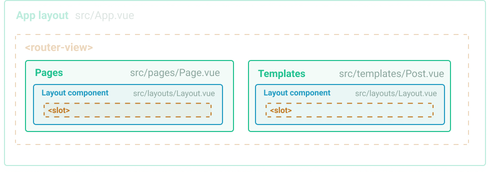

# Layout structure
There are two kinds of layouts in Gridsome projects.

1. **App layout** - The global layout that usually contains Header & footer.
2. **Layout components** - Layout components are optional components used to wrap pages & templates. Usually contains sidebar, sub navigation etc.

## App layout


**App layout is the component that wraps all content.** It usually contains components that are used across the site like **Header & Footer**. App layout requires a `<router-view>` component. This is where the content will be displayed.

App layout is located at `src/App.vue`.

### Basic App layout

### Add page transition

### Passing props

You can pass props to App layout from any page or component. This is useful if you want to change behavior in App layout for a single page.

```html
<style>
export default {
  appProps: {
    transparentHeader: true
  }
}
</style>
```


## Layout components



**Layout components** are layouts that you can import per Page & Template. It usually contains things like a Sub Navigation or a Sidebar. **A layout component requires a `<slot>` component**. This is where the content coming from pages and templates will be inserted. Layouts components can have [multiple slots](#multiple-content-slots).


```html
<!-- Layout -->
<template>
  <div>
    <aside>
      Sub Navigation
    </aside>
    <slot />
  </div>
</template>
```


### Import a layout component
```html
<!-- Page -->
<template>
  <SidebarNav>
    Add page content here
  </SidebarNav>
</template>

<script>
import SidebarNav from '~/components/SidebarNav.vue'

export default {
  components: {
    SidebarNav
  }
}
</script>

```

### Passing Props
Since layouts work like components, it is possible to pass Props to layouts. For example a page can look like this:


```html
<!-- Page -->
<template>
  <Layout :sidebar="true">
    Add page content here
  </Layout>
</template>
```

This will pass a Prop to a layout with `sidebar = true`. In the **Layout component** this could look like this: 

```html
<!-- Layout -->
<template>
  <div>
    <div class="main-content">
      <slot />
    </div>
    <div v-if="sidebar">
      Lets show the sidebar!
    </div>
  </div>
</template>

<script>
export default {
  props: ['sidebar']
}
</script>
```

### Multiple content slots
To add multiple slots to a layout you need to name them. In this example we have added a sidebar slot that will only show if the page has sidebar content.

```html
<!-- Layout -->
<template>
  <div>
    <slot /> <!-- Default slot  -->
    <div class="sidebar" v-if="$slots.sidebar">
      <slot name="sidebar" /> <!-- Sidebar slot  -->
    </div>
  </div>
</template>
```

Pages can now add content to this slot like this:

```html
<!-- Page -->
<template>
  <Layout>
    This is the default content

    <template slot="sidebar">
      This will be added to sidebar slot from the page
    </template>
  </Layout>
</template>
```