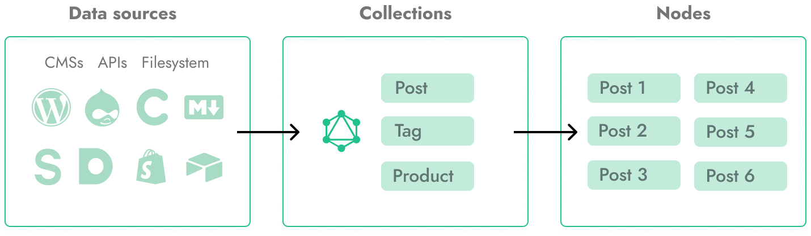

# Recipes

Quick answers for how to accomplish common tasks with Gridsome.

## App layout
App layout is the wrapper for the whole site. It's located at `src/App.vue`.

### Basic App layout

### App layout with page transition


## Pages
[Pages](/docs/pages/) is created by adding **Components** in `src/pages` folder.


### Basic page

```html
<template>
  <div>
    <h1>Hello, world!</h1>
  </div>
</template>

<script>
export default {
  metaInfo: {
    title: 'Hello, world!',
  }
}
</script>
```

### Page with a Query

### Page with Pagination

## Linking


### Linking in Components
...

### Linking in Markdown
...

## Images
Gridsome has a built-in `<g-image>` component that outputs an optimized progressive image.

### Images in Components

### Images in Markdown

### Images from GraphQL


## Styling

### Add a global CSS

### Install & use SCSS


## Collections
[Collections](/docs/collections/) are useful if you are going to have blog posts, tags, products etc. on your site. Collections can be sourced from any **Headless CMS, content APIs or Markdown files** by using [Source plugins](/plugins) or the [Data Store API](/docs/data-store-api/).



Collections are stored in a temporary [local GraphQL data layer](/docs/data-layer/) and can be [queried anywhere](/docs/querying-data/), [filtered](/docs/filtering-data/), [paginated](/docs/pagination/) or [have relations](/docs/taxonomies/).

### Sourcing a collection


[Learn more about Collections](/docs/collections/)

## Templates
[Templates](/docs/templates/) are responsible for displaying nodes (single pages) of collections. Templates are usually located in `src/templates`. Gridsome tries to locate a file with the same name as the Collection if no component has been specified in templates config.

Here is an example:

```html
<!-- src/templates/Post.vue -->
<template>
  <Layout>
  	<h1 v-html="$page.post.title" />
  </Layout>
</template>

<page-query>
query Post($id: ID!) {
  post(id: $id) {
    title
  }
}
</page-query>
```

[Learn more about Templates](/docs/templates/)

## Layouts
Layouts are **Vue Components** that are used inside Pages and Templates to wrap the content. A layout usually contains Header & Footer.

Layouts are usually used like this in Pages:

```html
<template>
  <Layout>
  	<h1>About us</h1>
  </Layout>
</template>

<script>
import Layout from '~/layouts/Default.vue'

export default {
  components: {
    Layout
  }
}
</script>
```

🙌 Layouts can also be made [available globally](/docs/layouts#make-a-layout-global), so you don't need to import them per page.

[Learn more about Layouts](/docs/layouts/)


## Images
Gridsome has a built-in `<g-image>` component that outputs an optimized progressive image. It also resizes and crops in real-time when developing if **width** and **height** is changed. `<g-images>` creates a super small **blurred inline base64 image** and then uses IntersectionObserver to lazy load image when in view.

[Learn more about g-image](/docs/images/)


