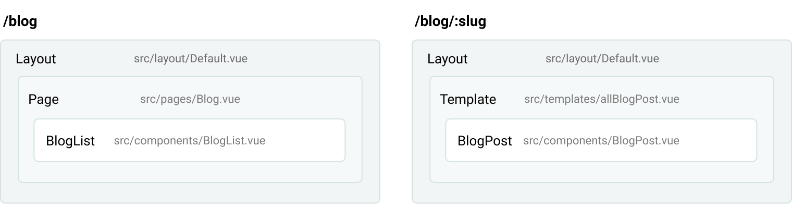

# Templates

> **Templates are usually used for view of a GraphQL collection.**

They are just like pages, except they will not get a path based on the file
location. Instead, they'll be used to render pages from data sources in your
project. The filename must match the GraphQL node type it will be a template
for. If you have a **node type** called `WordPressPost`, then you can create a file
in `src/templates/WordPressPost.vue`.

Template components must have a `<page-query>` block which fetches the source node
for the current page. You can use the `$path` variable to get the node.

```html
<!-- src/templates/WordPressPost.vue -->

<template>
  <Layout :title="$page.post.title">
    <div v-html="$page.post.content">
  </Layout>
</template>

<page-query>
query Post ($path: String!) {
  post: wordPressPost (path: $path) {
    title
    content
  }
}
</page-query>

<script>
export default {
  metaInfo () {
    return {
      title: this.$page.post.title
    }
  }
}
</script>
```


## Template hierarchy

If a data source have a route like `/blog/:slug` its recommended to create a [Page](/docs/pages) in `src/pages/Blog.vue` for the `/blog` route endpoint. This page will list blog posts and can have pagination. A `page` always overwrites a `template` endpoint. All other routes inside `/blog` will look for a template with the data source schema name (For example WordPressPost).


