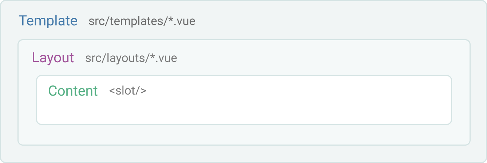

# View structure
Basic overview of how layouts, pages and templates renders.

## Pages

Pages are usually used for normal pages or for **listing items** from a data store collection. All `.vue` files in `src/pages` will become a page. Learn more about [Pages](/docs/pages).


In code this will look something like this:

```html
<template>
  <Layout>
   	Here comes the page content
  </Layout>
</template>
```

## Templates

Templates are used for the **single post** template of a GraphQL collection. If a collection has type name `BlogPosts` you simply create a `src/templates/BlogPosts.vue` file to create a template. Learn more about [Templates](/docs/templates)





## Layouts
Layouts are components used to wrap content inside Pages and Templates. It usually has a Header and a Footer and a `<slot/>` component that will render the content.

Learn more about [Layouts](/docs/layouts)


## 404
To create a custom `404` you need to add a `404.vue` in `src/pages`