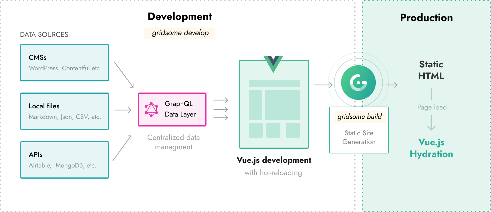

# How it works

Gridsome is a modern website development framework for creating fast and secure websites that can be deployed anywhere. Static HTML files are generated to create SEO-friendly markup that hydrates into a <strong>Vue.js-powered SPA</strong> once loaded in the browser.

Source plugins fetch content from local files or external APIs and store the data in a local database. A unified GraphQL data layer lets you extract only the data you need from the database and use it in your Vue.js components. The data is generated and stored as static JSON at build time.

There are two ways to run Gridsome:

- `gridsome develop` - Starts a **local development server**.
- `gridsome build` - Generates **production ready** static files.

## Gridsome develop

The `gridsome develop` command starts a **local development server** with hot-reloading for code/file changes and the **GraphQL data layer**. You can usually open the development server at `localhost:8080`, and explore the GraphQL data layer at `localhost:8080/___explore`.

**This is what's happening under the hood when running `gridsome develop` command:**

1. **Initialize** - Reads project configuration and initializes installed plugins, etc.
2. **Load sources** - Source plugins fetch their data and update the internal store.
3. **Create GraphQL schema** - Generates the GraphQL schema from node types in the store.
4. **Generate code** - Generates runtime code like routes, plugins, etc.
5. **Bootstrap finish** - Starts the development server and shows the URLs in your console.

## Gridsome build

The `gridsome build` command prepares a project for **production**. This means it generates HTML files that are optimized and ready to be hosted and deployed to any FTP or static web host.

**This is what's happening under the hood when running `gridsome build` command:**

1. **Initialize** - Reads project configuration and initializes installed plugins, etc.
2. **Load sources** - Source plugins fetch their data and update the internal store.
3. **Create GraphQL schema** - Generates the GraphQL schema from node types in store.
4. **Generate code** - Generates runtime code like routes, plugins, etc.
5. **Bootstrap finish** - Creates a render queue with all pages and templates.
6. **Run GraphQL** - Executes all `page-query` queries and stores the results in `json` files.
7. **Compile assets** - Runs webpack to compile production-ready assets.
8. **Render HTML** - Renders all pages and templates into static `html` files.
9. **Process files** - Local files are copied to the `dist` folder.
10. **Process images** - Local images are processed and copied to the `dist` folder.

> Services like **Netlify** and **ZEIT Now** let you run `gridsome build` automatically from a **Git-repository** and host the generated files on a CDN for you. These services also have hooks that enable you to re-build the site after a Git-commit. Learn more about Git-based [deployment here](/docs/deployment/).
