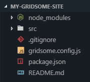
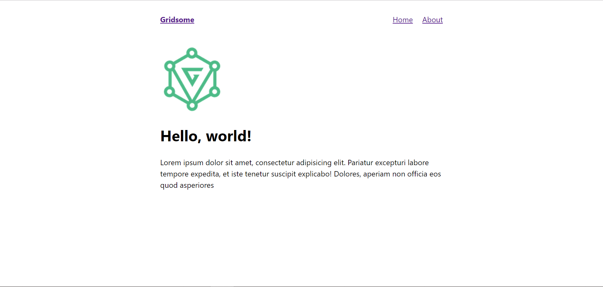

# 1. Basic Gridsome

In the previous section, you have set-up your local development environment by installing all the necessary tools.

Now, let's dive deeper into the code, in this tutorial we will be creating a blogging site.

## Install the starter

In this tutorial, we're going to use Gridsome CLI to install [Gridsome's default starter kit](https://github.com/gridsome/gridsome-starter-default).

1. Open your terminal
2. Run command `gridsome create my-gridsome-site gridsome/gridsome-starter-default` to create a new project.
3. Run `cd my-gridsome-site` open the directory
4. Run `gridsome develop` to create a local development server at `http://localhost:8080`

**What just happened now...**

```sh
gridsome create [SITE_DIRECTORY_NAME] [URL_OF_STARTER_GITHUB_REPO]
```

When creating a new Gridsome site, you can use the following command structure to create a new site using an existing Gridsome starter kit.

```sh
gridsome create my-gridsome-site https://github.com/gridsome/gridsome-starter-default
```

- Starting from gridsome, requesting to use Gridsome CLI.
- `create` is a command to create new Gridsome project.
- Using an arbitrary project name `my-gridsome-site`, you can choose any of your choice. The CLI will do all the hard work for you and move the code of your new site in a newly created folder name "my-gridsome-site".
- Lastly, the GitHub URL specified points to a code repository that holds the starter code you want to use.

```sh
cd my-gridsome-site
```

- Change the directory to "my-gridsome-site" sub-directory. Whenever you run any commands for your site, you need to be in the context for that site *(aka, your terminal needs to be pointed at the directory where your site code lives)*.

```sh
gridsome develop
```

- This command starts a development server. You will be able to see and interact with your new site on your local machine.
- Open up a new tab in your browser and navigate to `http://localhost:8080`

You’ll be able to visit the site locally at `http://localhost:8000` for as long as your development server is running. That’s the process you started by running the `gridsome develop`. To stop running that process *(or to "stop running the development server")*, go back to your terminal window, hold down the "control" key, and then hit "c" *(ctrl-c)*. To start it again, run `gridsome develop` again!

Let's add more features to your site and create a blogging website where you can add add new blog in markdown format.

### Open in code editor

In your code editor, take a look at the different directories and files contained in the "my-gridsome-site" directory. It should look something like this:



*Note: The editor shown here is Visual Studio Code. If you’re using a different editor, it will look a little different.*

## Introducing Pages

The code must be still new to you. Let's get familiar with Gridsome code and how it works.

Each file you create in `pages` directory, will be access in your browser. For example: `pages/About.vue` ⇒ `http://localhost:8080/about`.

Navigate to `/src/pages/index.vue` file, the code in this file outputs the content on `http://localhost:8080`.



```html
<template>
  <Layout>
    <g-image alt="Example image" src="~/favicon.png" width="135" />
    <h1>Hello, world!</h1>
    <p>Lorem ipsum dolor sit amet, consectetur adipisicing elit. Pariatur excepturi labore tempore expedita, et iste tenetur suscipit explicabo! Dolores, aperiam non officia eos quod asperiores</p>
  </Layout>
</template>
```

> Gridsome uses hot reloading to speed up your development process, it watches in the background which are being updated - any time you save a file, your changes will be immediately reflects in your browsers. You don't have to refresh the page or restart the development server.

1. Open your text editor and browser side-by-side and change the "Hello, world!" text to "Hello Gridsome!", and save the file, you will see that your code and content changes reflected almost instantly in the browser after you save the file.
2. Let's mess around with the styles. Try adding the below code in `src/pages/index.vue`, and save again. You'll see changes to the heading; The text color will be green, and the font size will be larger.

```html
<template>
  <Layout>
    <g-image alt="Example image" src="~/favicon.png" width="135" />
    <h1>Hello, world!</h1>
    <p>Lorem ipsum dolor sit amet, consectetur adipisicing elit. Pariatur excepturi labore tempore expedita, et iste tenetur suscipit explicabo! Dolores, aperiam non officia eos quod asperiores</p>
  </Layout>
</template>

<script>
  export default {}
</script>
```

> This is just a glimpse about styling, we will cover more in part two.

3. Remove `g-image` and change the text inside the paragraph.

```vue
<template>
  <Layout>
    <h1>Hello, world!</h1>
    <p>What's happening in the world!</p>
  </Layout>
</template>
```

## Set site title & description

Let's make your website crawlable on search engines

Till now nobody knows about your website, why not give it a title and description.

A title and description tag is an HTML element that describes a web page.


Title tags are displayed on search engine results pages as the clickable headline, whereas description give us a brief overview of that headlines.

1. Open `gridsome.config.js` file
2. Paste this code snippet in your file.

> This data is globally accessible across your website

```js
module.exports = {
  siteName: `Gridsome Starter Blog`,
  siteDescription: `This is my blogging website.`
  titleTemplate: `%s - Gridsome`
}
```

Currently, you cannot defined custom data, here is the [list of option available](../docs/config).

Using only these three lines of code will not make your website rank higher in search results, you need to use other meta tags, about which we will learn later in this tutorial.

## Create a page

## Link between pages

## Using shared components

## Insert a image

